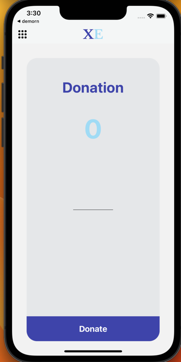

# Amaze Cart

## Topics Covered

### Implementing react concepts

- React Hooks
- React Context (Store)

### Implementing react native concepts

- [StyleSheet](https://reactnative.dev/docs/stylesheet)
- [WebView](https://github.com/react-native-webview/react-native-webview)
- [React Native Components](https://reactnative.dev/docs/components-and-apis)
- [React Native API](https://reactnative.dev/docs/components-and-apis)
- [React Native Hooks](https://reactnavigation.org/docs/use-navigation/)
- [Accessibility](https://reactnative.dev/docs/0.66/accessibility)
- [Splash Screen](https://medium.com/@rfontes/splash-screens-on-react-native-without-libs-b487d08264ee)
- [Bottom Sheet](https://gorhom.github.io/react-native-bottom-sheet/)
- [App Icon](https://medium.com/@ansonmathew/app-icon-in-react-native-ios-and-android-6165757e3fdb)
- [Android Native Module](https://reactnative.dev/docs/native-modules-android)
- [iOS Native Modules](https://reactnative.dev/docs/native-modules-ios)
- [Animation](https://docs.swmansion.com/react-native-reanimated/)

### Storage

- [Async Storage](https://www.npmjs.com/package/@react-native-async-storage/async-storage)
- [react-native-keychain](https://www.npmjs.com/package/react-native-keychain)
  - Keychain Storage for iOS
  - Keystore Storage for Android

### Flavours & Schemas 

- Different Flavours for android Apps.
- Different Schemas for iOS Apps 

### Adding React Native Vector Icons

- Used [React Native Vector Icon](https://www.npmjs.com/package/react-native-vector-icons) Package to render icons.

### Adding navigation

- Stack Navigation
  - Authentication & Application have separate stacks
- Drawer Navigation
- Bottom Tab Navigation
- Nested Navigation

### Authentication

- Password Authentication
  - [dummyjson server](https://dummyjson.com/docs/auth)
- OAuth Authentication
  - [Google Signin](https://ibjects.medium.com/google-signin-tutorial-for-react-native-81a57fb67b18)
    - google-signin package
  - [Github Signin](https://github.com/settings/apps)
    - Registered the application in the developer console.
    - OAuth flow using webview.

### Testing

- unit testing using [React-Native-Testing-Library](https://callstack.github.io/react-native-testing-library/docs/getting-started)

### Assets (Images & Fonts)

- Linked using npx [react-native-asset](https://www.npmjs.com/package/react-native-asset)

` To Link The Images Fonts Use THe Below Command`

> npx react-native-asset

## Usages

### Start the Bundler

` To Start The Metro Bundler`

> npm start

or

> yarn start

### Build & Run

`To Build and Run the Application on the Simulator`

- android

  > npm run android:dev (devDebug Variant) | npm run android:demo (demoDebug Variant)

  or

  > yarn run android:dev (devDebug Variant) | yarn run android:demo (demoDebug Variant)

- ios

  > npm run ios:dev (devDebug Variant) | npm run ios:demo (demoDebug Variant)

  or

  > yarn run ios:dev (devDebug Variant) | npm run ios:demo (demoDebug Variant)

### Test Runner

`To Run The Test Suite`

> npm test -- --watch

or

> yarn test --watchAll

### Test Coverage

`To Run The Test Suite`

> npm test --coverage

or

> yarn test --watchAll --coverage

### Clear Cache

`To Clear Cache and Run`

> npm start --reset-cache

or

> yarn start --reset-cache

## Screens Preview

## Login Page

## Signup Page

## Product Dashboard

## Filtered Products

## Product Details Page

## Adding the Product to the Cart

## Favorite Products

## Product Details in Bottom Sheet in Favorites

## Cart

## Empty Cart

## Google SignIn

## GitHub SignIn

## Login through Browser

## Donation Screen Using Native Modules

### Note :

- used [fakestore](https://fakestoreapi.com/) Api's to fetch the product related Details

### Design Inspired from :

- [Dribble Ecommerce Style](https://dribbble.com/shots/14093717-Ecommerce-Mobile-App/attachments/5715187?mode=media)
- [Dribble Login Style](https://dribbble.com/shots/14889725-App-UI)
